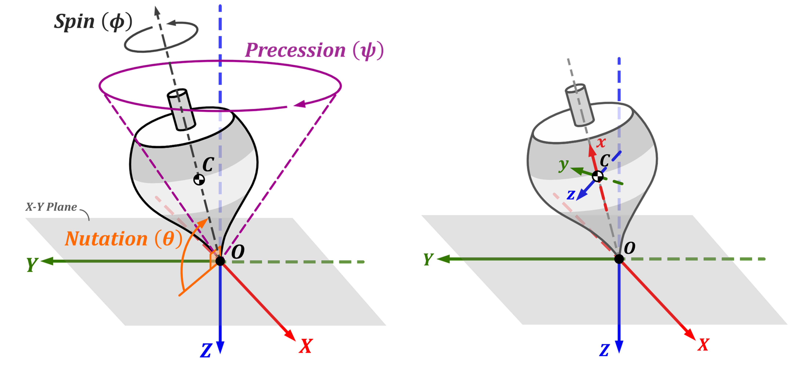
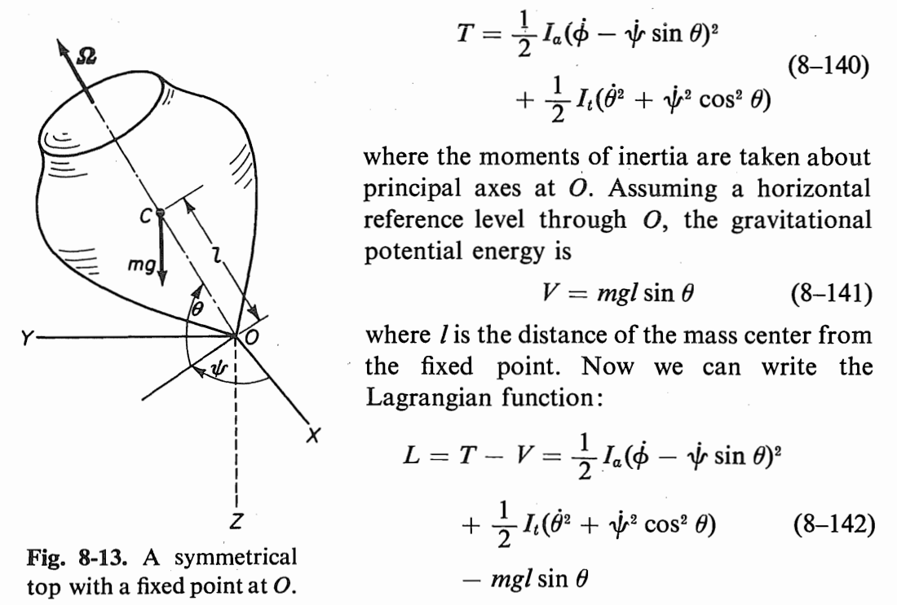

# **The-Motion-of-a-Top**
**Analytical Dynamic Project (254721)**\
**Made by:** Wongsakorn Wongchompu\
**Reference:** Donald T. Greenwood - PRINCIPLES OF DYNAMICS

## **The Motion of a Top (Chapter 8 Section 8-5)**
**Generalize Coordinates**:   $q_i=\{\psi,\theta,\phi \}$\
     

## **Library Installation**
Before running this code on your computer, please install the following libraries below:\
`pip install sympy`\
`pip install numpy`\
`pip install matplotlib`\
`pip install plotly`\
`pip install scipy`\
`pip install ipython`
